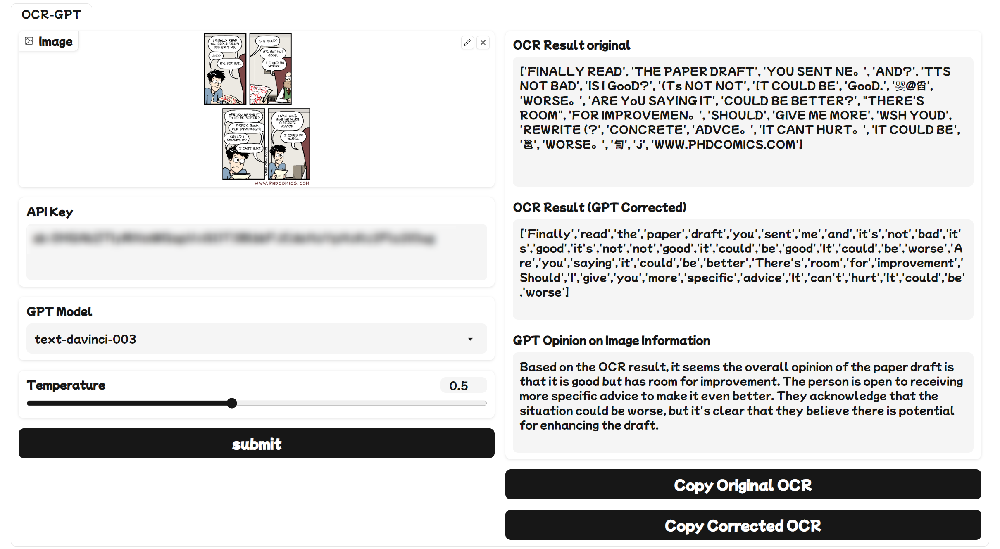

# OCR-GPT

这个仓库包含了一个使用OCR和GPT分析图像文本的Python应用程序的代码。该应用程序可以从图像中提取文本，并使用不同的GPT模型生成对图像内容的评价。你可以通过Gradio用户界面来运行和测试这个应用程序。

This repository contains the code for a Python application that analyzes text from images using OCR and GPT. The app can extract text from images and use different GPT models to generate reviews of the image content. You can run and test the application through the Gradio user interface.

---

# Hi！

我很高兴地宣布，我已经在GitHub上开源了一个结合OCR和GPT的文本识别软件。这个软件可以从图片中提取文本，并用GPT模型生成有意义的内容。你可以在这里找到我的项目:

https://github.com/NowLoadY/OCR-GPT

# Star & Improvement

如果你对这个仓库感兴趣，欢迎给我一个star，让更多的人知道这个简单但有趣的工具。我也非常乐意看到有人提交修改，帮助我改进这个软件的功能和性能。  
If you are interested in this repository, welcome to give me a star to let more people know about this simple but interesting tool. I am happy to see someone submit changes that help me improve the functionality and performance of this software.  
The deployment on the hugging face requires a GPU environment, but I don’t have funds, so it only supports running locally at present, thank you for your understanding

# pip install ❤️
- easyocr
- gradio
- openai
- pyperclip
- webbrowser
- pyspellchecker
